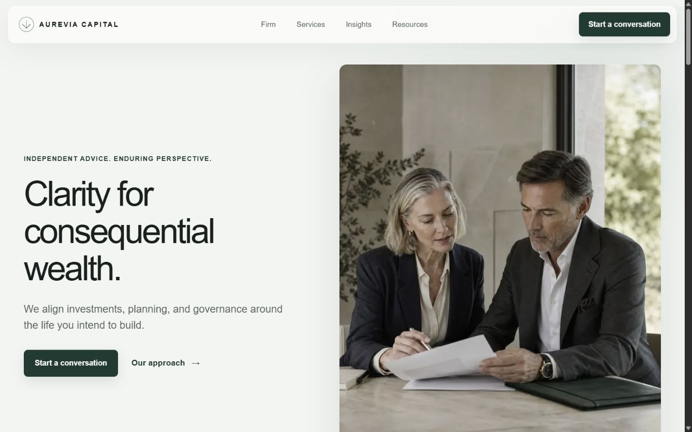
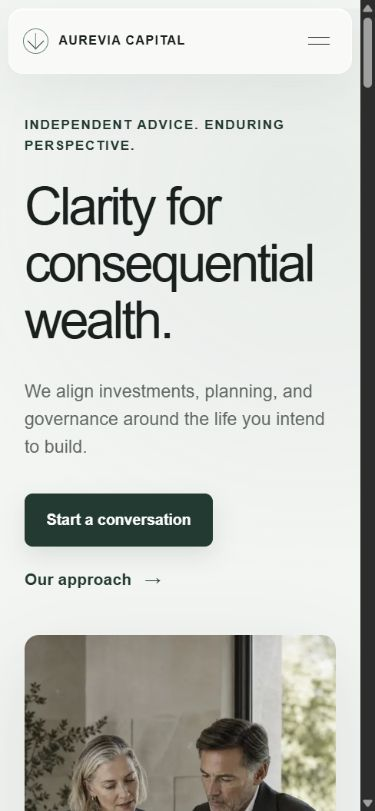

# HubZero Finance + Premium Blueprint

This repository is HubZero's canonical Finance architecture combined with the Premium design language. It is a reusable, production-ready foundation for financial advisory, wealth management, family office, and institutional investment websites.

The company shown in the experience, Aurevia Capital, is entirely fictional. Its people, contact information, services, testimonials, office, and publications exist only to demonstrate the Blueprint.

## Technology

- Next.js 16 App Router
- React 19
- TypeScript in strict mode
- Tailwind CSS 4 infrastructure with a custom token-led design system
- Server Components by default, with isolated client components for navigation and reveal behavior

## Getting started

```bash
npm install
npm run dev
```

Open `http://localhost:3000`.

## Reference screenshots





## Verification

```bash
npm run lint
npm run typecheck
npm run build
```

## Architecture

The implementation supports the complete financial trust journey:

1. Firm overview and positioning
2. Advisory services
3. Service expertise
4. Leadership credibility
5. Educational insights and resources
6. Transparent FAQs and disclosures
7. Honest contact path

Key routes include:

- `/`
- `/about`
- `/leadership`
- `/services`
- `/services/[slug]`
- `/insights`
- `/insights/[slug]`
- `/resources`
- `/faqs`
- `/contact`
- `/privacy`
- `/terms`

## Customization

Brand and business values are centralized:

- `src/config/site.ts` for identity, URL, asset paths, and contact details
- `src/config/navigation.ts` for primary and footer navigation
- `src/content/content.ts` for services, insights, leadership, testimonials, values, and FAQs
- `src/styles/tokens.css` for the visual system
- `public/brand/` for logo, favicon, touch icon, and social preview assets
- `public/images/` for replaceable editorial photography

Shared Blueprint Base infrastructure remains in `src/components/layout`, `src/components/shared`, `src/providers`, `src/seo`, `src/hooks`, and `src/utils`.

## SEO and structured data

The Blueprint includes unique route metadata, canonical URLs, raster Open Graph assets, Twitter cards, robots, sitemap generation, Organization, FinancialService, WebSite, BreadcrumbList, FAQPage, and Article structured data.

Before adapting the Blueprint for a real company, replace the example domain and every fictional disclosure with reviewed business and regulatory information.

## Content and imagery

All Aurevia content and photography were generated specifically for this fictional reference implementation. No real organization, employee, client, testimonial, or location was copied or adapted. Photography is optimized as WebP and referenced through centralized content.

## Project structure

```text
src/
  app/          Routes, lifecycle pages, metadata entry points
  components/   Brand, layout, and shared presentation components
  config/       Site and navigation configuration
  content/      Replaceable finance content model
  hooks/        SSR-safe interaction hooks
  providers/    Application providers
  seo/          Metadata, JSON-LD, robots, sitemap, manifest
  styles/       Shared design tokens
  utils/        Shared utilities
public/
  brand/        Integrated brand and social assets
  images/       Generated editorial photography
```

## HubZero

This repository is a HubZero Blueprint demonstration. Blueprint Core guidance lives in `.hubzero` and remains the source of truth for architecture, design, SEO, experience, engineering, review, and release standards.
